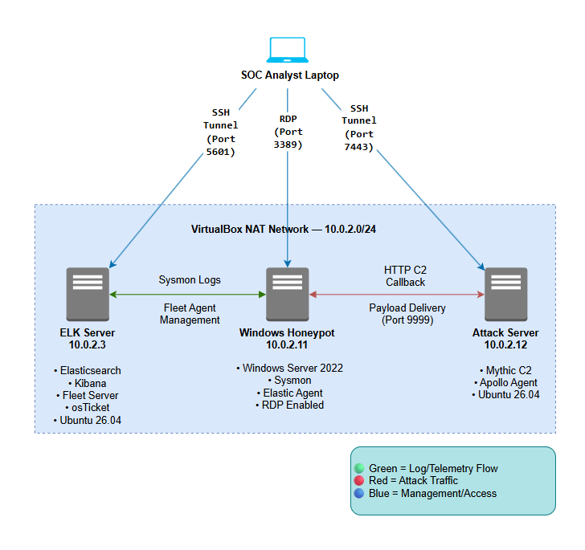
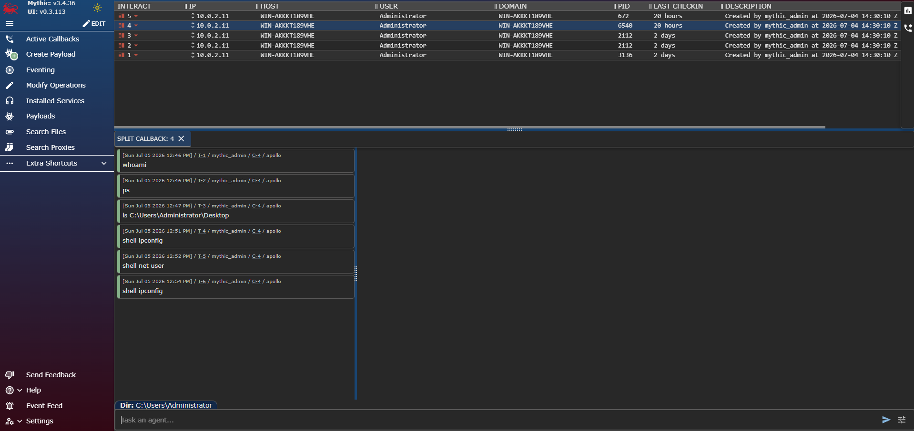
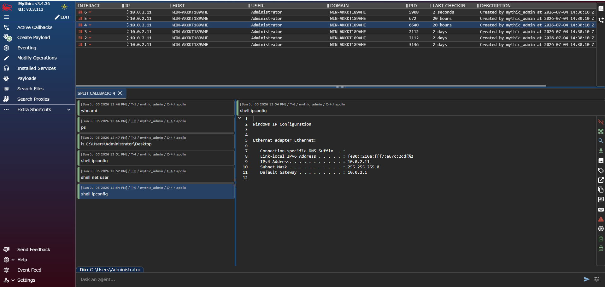
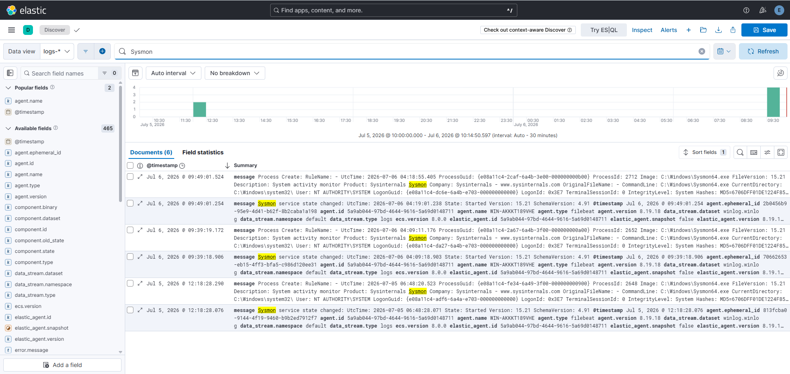
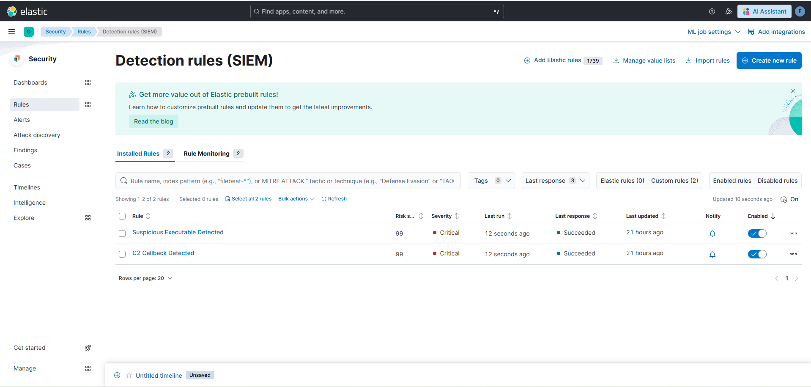
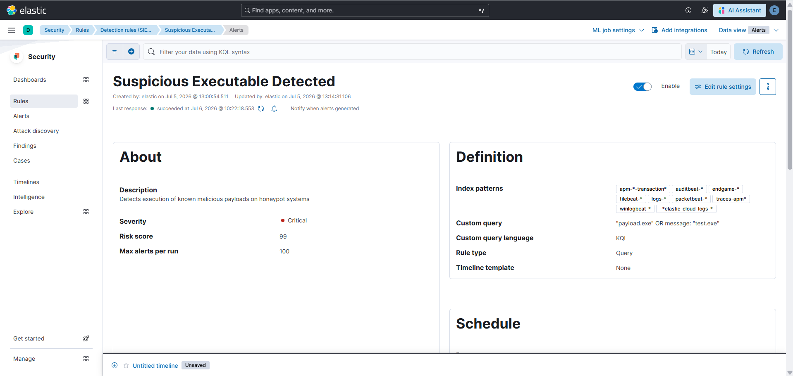
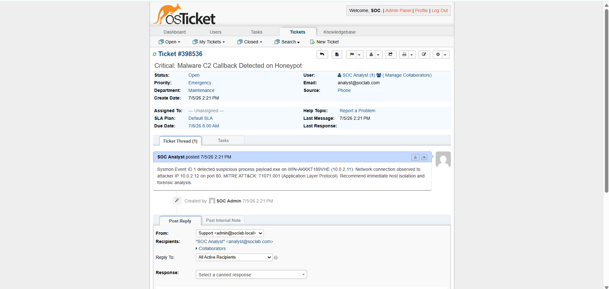

#  Full-Stack Security Operations Center (SOC) Lab & Threat Emulation

##  Overview
A fully functional SOC environment built from scratch to simulate, detect, and respond to advanced cyber threats. This project demonstrates the complete Purple Team lifecycle — from adversary emulation using a Mythic C2 framework to automated SIEM detection and incident response ticketing.

**Goal:** Establish an end-to-end attack-and-defend workflow mapped to the MITRE ATT&CK framework.

---

##  Architecture

| Machine | Role | IP Address | OS | Key Components |
|---------|------|------------|----|----------------|
| **ELK Server** | Defender (SIEM) | `10.0.2.3` | Ubuntu 26.04 | Elasticsearch, Kibana, Fleet Server, osTicket |
| **Windows Honeypot** | Victim (Target) | `10.0.2.11` | Windows Server 2022 | Sysmon, Elastic Agent, RDP |
| **Attack Server** | Attacker (C2) | `10.0.2.12` | Ubuntu 26.04 | Mythic C2, Apollo Agent |

> All machines operate on an isolated `10.0.2.0/24` VirtualBox NAT network with static IP assignments and port forwarding for management access.

---

##  Technology Stack
| Category | Tools |
|----------|-------|
| **SIEM & Log Management** | Elasticsearch, Kibana, Fleet Server, Elastic Agent |
| **Endpoint Telemetry** | Sysmon (SwiftOnSecurity config) |
| **Threat Emulation** | Mythic C2 Framework, Apollo Agent (HTTP Profile) |
| **Incident Response** | osTicket |
| **Infrastructure** | Ubuntu Linux, Windows Server 2022 |
| **Framework** | MITRE ATT&CK |

---

##  Attack Simulation (Red Team)

The attack follows the **Cyber Kill Chain** and maps to MITRE ATT&CK techniques:

| # | Kill Chain Phase | MITRE ATT&CK | What I Did |
|---|-----------------|---------------|------------|
| 1 | **Weaponization** | T1587.001 | Built an Apollo C2 agent (EXE) with HTTP profile in Mythic |
| 2 | **Delivery** | T1105 | Hosted payload on Attack Server; downloaded via PowerShell `Invoke-WebRequest` |
| 3 | **Execution** | T1204.002 | Executed `payload.exe` on the Windows Honeypot |
| 4 | **Command & Control** | T1071.001 | Apollo agent established covert HTTP beacon to `10.0.2.12:80` |
| 5 | **Discovery** | T1033, T1057 | Ran `whoami`, `ipconfig`, `ps` via Mythic interactive shell |

### Mythic C2 — Active Callback

### Attacker Reconnaissance Commands

---

##  Detection Engineering (Blue Team)

### Endpoint Telemetry
Sysmon (configured with the SwiftOnSecurity ruleset) captures deep endpoint activity that native Windows logging misses:
- **Event ID 1** — Process Creation (with full command-line arguments)
- **Event ID 3** — Network Connection (source/destination IP and port)
- **Event ID 11** — File Creation

Elastic Agent ships all Sysmon events to Elasticsearch in near-real-time via Fleet Server.

### Sysmon Logs in Kibana Discover

### Custom Detection Rules (KQL)
| Rule Name | Severity | Query Logic |
|-----------|----------|-------------|
| Suspicious Executable Detected | 🔴 Critical (99) | `message: "payload.exe"` |
| C2 Callback Detected | 🔴 Critical (99) | `message: "10.0.2.12" AND message: "payload.exe"` |

### Alerts Firing
Both rules successfully triggered Critical alerts when the Apollo agent executed and established the C2 callback:

---

##  Incident Response

When the SIEM generated alerts, the SOC workflow transitioned to incident documentation via **osTicket**:
- **Ticket Subject:** Critical: C2 Callback Detected on WIN-AKKKT189VHE
- **Affected Host:** `10.0.2.11` (Windows Honeypot)
- **MITRE Technique:** T1071.001 (Application Layer Protocol)
- **Recommended Action:** Immediate host isolation, firewall block on C2 IP, forensic disk imaging

---

##  Key Takeaways

1. **Traditional firewalls are not enough.** The C2 traffic used port 80 (HTTP) — any basic firewall would allow it. You need endpoint telemetry (Sysmon) and a SIEM to detect modern threats.
2. **Sysmon is essential.** Native Windows Event Logging lacks the granularity for threat hunting. Sysmon provides process ancestry, command-line arguments, and network connection details that are critical for detection.
3. **Detection rules must be technique-driven.** Mapping rules to MITRE ATT&CK ensures comprehensive coverage and helps SOC teams prioritize based on real-world adversary behavior.
4. **Incident documentation is mandatory.** Every security framework (NIST, ISO 27001, PCI DSS) requires a documented incident response process.

---

---

## 📬 Contact
**SHRI HARI S** — [LinkedIn]www.linkedin.com/in/shrihari16705 — shrihari16.705@gmail.com
